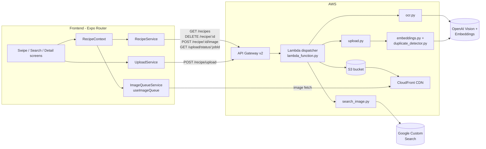
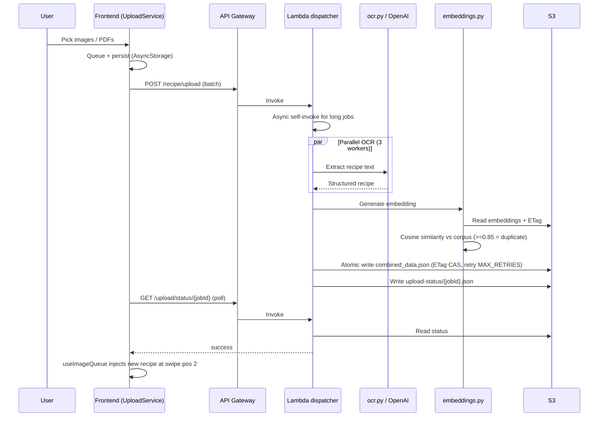

# SavorSwipe Architecture

One-page system overview. For deployment mechanics see
[DEPLOYMENT.md](DEPLOYMENT.md); for contributor workflow see
[../CONTRIBUTING.md](../CONTRIBUTING.md).

## Component Diagram

## Upload Flow

## S3 Data Layout

| Key | Purpose | Notes |
|---|---|---|
| `jsondata/combined_data.json` | All recipe metadata | Single document, ETag-locked writes |
| `jsondata/recipe_embeddings.json` | 1536-dim vectors | Used for duplicate detection |
| `images/{key}.jpg` | Recipe images | Served via CloudFront |
| `upload-status/{jobId}.json` | Async job completion flags | 7-day lifecycle TTL |
| `upload-pending/{jobId}.json` | Pending async job payloads | Cleared on completion |

## Boundaries and Invariants

- Frontend never talks to S3 directly for writes; all mutations go through
  API Gateway -> Lambda.
- Lambda constructs `boto3` clients at module scope (cold-start optimization).
- Routing uses an explicit dispatch table keyed on `(method, path_pattern)`;
  no substring matching.
- All backend responses use the envelope `{success, error?, data?}`.
- Recipe data is normalized via `normalizeRecipe()` before consumption;
  downstream code branches on the `kind` discriminant.
